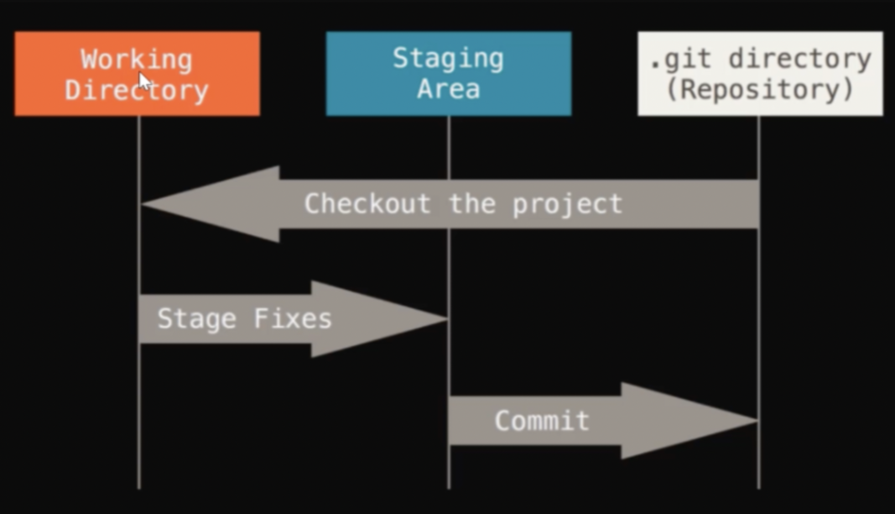
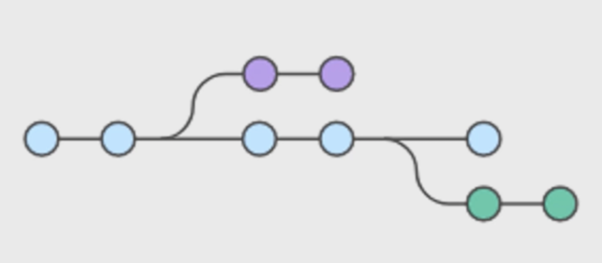
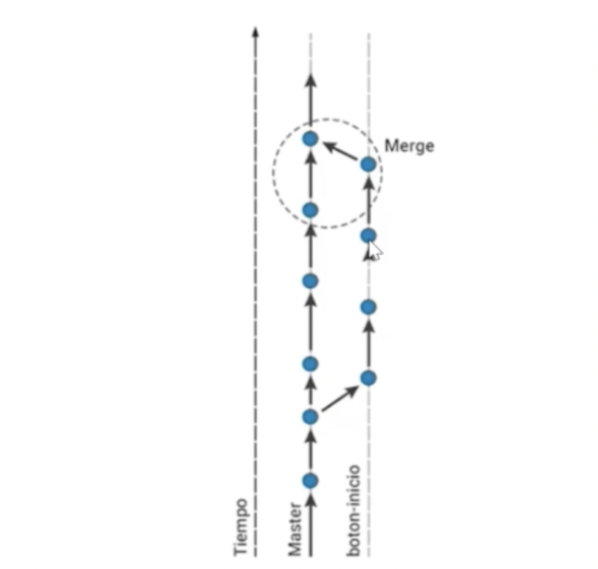
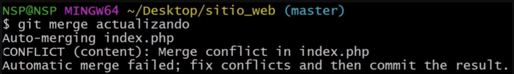
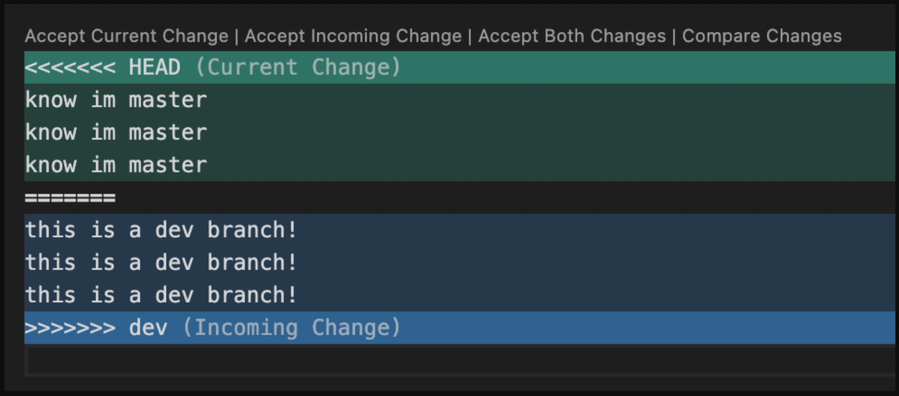

# GIT {


`GIT: Software de control de versiones`.

Este programa nos permite `gestionar versiones de nuestro código` (gestionar código fuente). Más concretamente `gestiona las versiones de un archivo que evoluciona a lo largo del tiempo`. Por eso recibe el nombre de `VCS` (Version Control Software).

```bash
GIT: Permite una organización horizontal de los archivos (no jerárquica) y nos permite controlar la evolución de nuestro programa.
```

Todo ello se lo debemos a [Linus Torvalds](https://github.com/torvalds) que no sólo fue el creador de Git (porque, en sus propias palabras, no se fiaba de los desarrolladores) sino que es mundialmente conocido por crear el [SO Linux](https://github.com/torvalds/linux).

Para verificar que tenemos `git` instalado en nuestro ordenador basta con que ejecutemos el comando de versión en nuestra terminal. Si obtenemos respuesta con el número de versión de git, todo es correcto:

```bash
git --version
# git version 2.35.1
```

## Stages

Una vez que ejecutamos `git init .` (sólo una vez por repositorio) se crea una carpeta oculta en nuestro repositorio local. En este instante, la carpeta pasa a estar controlada por el programa git.

Al iniciar git en una de nuestras carpetas nuestros archivos pasarán a tener `3 estados`:

- `Working Directory`: trabajo local en mi ordenador.
- `Staging Area`: Se conforma por todos los archivos (referidos como `untracked files`) que formarán parte del próximo commit. Aquí se producirá el control de cambios desde git con el comando `git add .`.
- `Repository`: control de cambios en github con los comando de `git commit` y `git push`.



Básicamente git es un programa que prepara la carpeta que contiene nuestro proyecto (en nuestro equipo local) para una "instantánea" (llamada `commit`) de su forma y configuración exacta en un momento del tiempo. De esta manera salvamos los progresos de manera rápida y segura. Además, estás "instantáneas" se integran con el llamado control de versiones.

`Control de versiones`: Es un conjunto de procedimientos que registran los cambios realizados en un archivo o un conjunto de los mismos. Nos permite recuperar el estado de nuestros archivos en distintos momentos del tiempo (`recuperación de versiones`).

- Ventajas:

  - `Operaciones locales`: solo necesita archivos locales para trabajar (con la rapidez que ello implica).
  - `No internet`: podemos guardar nuestros cambios con GIT y sincronizarlos cuando recuperemos internet.
  - `No borra`: es muy dificil borrar o dañar algo que no se pueda enmendar.
  - `Integridad`: no perdemos las copias ya salvadas porque todas están identificadas con su SHA-1 y se calculan en base a los contenidos de los archivos.

## TIP

Desde Visual Studio Code podemos configurar un comando específico para abrir archivos con este mismo editor de código:

```bash
command p
'> install code commmand in PATH'
```

## Compendio

- `GIT`: Software de control de versiones. Software de control de versiones diseñado por Linus Torvalds, pensando en la eficiencia y la confiabilidad del mantenimiento de versiones de aplicaciones cuando estás tienen un gran número de archivos de código fuente.
- `Repositorios`: Punto donde se almacenan todos nuestros archivos. Hay dos tipos: local y remoto.
- `GitHub`: Red social de programadores.
- `Terminal`: Acceso e interacción con nuestro sistema operativo y optimización del trabajo como desarrolladores. Todos los OS tienen su propio sistema de terminal.

## Git general

- `git init`: crea un repositorio local junto con la carpeta .git (inicializamos git en la carpeta actual).
- `git --version`: el output nos devuelve la versión actual de git instalada en nuestro equipo.
- `git help`: nos devuelve toda la información de instrucciones dentro de git.
- `git help <instrucción>`: nos devuelve toda la información de instrucciones del comando commit.

## Git alias

- `git config --global alias.s "status --short"`: crear un alias.
- `git config --get-regexp alias`: comprobamos la lista de alias creados en nuestro equipo.
- `git config --global --unset alias.trololo`: borramos el alias indicado.

```bash
git config --global alias.lg "log --graph --abbrev-commit --decorate --format=format:'%C(bold blue)%h%C(reset) - %C(bold green)(%ar)%C(reset) %C(white)%s%C(reset) %C(dim white)- %an%C(reset)%C(bold yellow)%d%C(reset)' --all"
```

## Git & GitHub

- `git status`: Comprueba el estado actual de un repositorio
- `gst`: Atajo git status

- `git diff`: comparación cambios actuales y último commit

- `git add <file_name>`: cambios de fichero a stage
- `git reset HEAD <nombre_archivo>`: eliminar archivo del stage
- `git commit -am "mensaje"`: Realizar un commit con mensaje. La `a` sirve para añadir los archivos modificados.

- `git branch`: el output nos indica en que rama nos encontramos actualmente.
- `git branch -m new-name`: renombrar rama actual.
- `git branch -m old-name new-name`: renombrar rama.
- `git branch -a`: listar ramas.

- `git checkout -- .`: nos devuelve al commit anterior.
- `git log`: Ver los commits realizados (pulsa q para salir)
- `git remote -v`: Ver a que repositorios remotos esta vinculado este repo

- `git push origin main`: Sube la rama main a git
- `git pull origin main`: Descarga la rama main a git

- `git checkout <commit-id>`: Go back to the selected commit on your local environment
- `git checkout -b <nombre_rama>`: Crea una nueva rama (sale en github si haces `git push origin <nombre_rama`)
- `git merge <rama>`: En local, vuelca el estado de una `<rama>` sobre la rama en la que nos encontremos. Este proceso no borra las ramas.
- `git checkout <nombre_rama>`: Cambia de rama

- `git remote set-url origin git://new.url.here`: change the remote Git repository URL
- `git remote remove origin`: remove the remote Git repository URL
- `git checkout -b new_branch`: init new branch before existing repo pull

- `git log --graph --all`: Ver las ramas como un gráfico en nuestra terminal

- `rm --cached -r ./<nombre_carpeta>`: elimina una carpeta del control de git (pero no de mi local)

## Flujo de trabajo

```bash
# 1. Crear un repositorio
git init .

# 2. Ver el estado de un repositorio git
git status

# 3. Trackear un fichero para que git lo controle
git add <filename>

# 4. Hacer un commit
git commit -am "<mensaje>"

# 5. Ver que repositorios remotos tengo vinculado
git remote -v

# 6. Subir el codigo a github
git push origin main

# 7. Ver commits en local (pulsa q para salir)
git log

# 8. Crear una nueva rama
git checkout -b <nombre_rama>

# 9. Cambiar de rama
git checkout <nombre_rama>

# 10. Merge de una rama en la rama actual
git merge <rama_de_la_que_me_traigo_los_cambios>
```

### Resolver conflictos

Tantas veces como ficheros conflictivos

```bash
git add <fichero_conflictivo>
```

```bash
git commit
```

## Commit

Cuando ejecutamos un commit `guarda el estado de una carpeta en un momento temporal` (congelamos el estado de la carpeta en un momento concreto). Una carpeta que opera bajo el control de git nuestros archivos tendrán distintos estados:

- `untracked file`
- `changes to be commited`
- `git commit -am "Mi primer commit"` (para añadir los ficheros modificados al commit).

La potencia de git es que nos permite viajar en el tiempo y `recuperar el estado de nuestro proyecto` en los puntos marcados mediante los propios commit.

Para sincronizar un proyecto con GitHub primero debemos inicializar git en nuestra carpeta. Por norma, editaremos nuestros proyectos con Visual Studio Code. Aquí veremos todos los archivos de texto con sus extensiones: una extensión no es más que una convención (json, js, py, etc).

Tras editar un archivo, guardamos los cambios en el editor. Ahora `git status` nos indicará que hay cambios pendientes y podremos hacer un `git add` y `git commit -am "mi primer commit"`.

Ahora podemos hacer un `push` a nuestro repositorio remoto sincronizado. Una vez subido nuestro primer código a GitHub podemos ver en nuestro repositorio todo nuestro códdigo (especialmente si creamos un README.md).

Ventaja: si borramos o perdemos nuestro código podemos usar `git clone <URL>` para crear nuesamente la carpeta en nuestro local y, además, la carpeta ya estará vinculada remotamente a nuestro repositorio en GitHub.

`.gitignore`: es un fichero muy útil que permite indicar que archivos queremos que git ignore. Aquí solemos indicar archivos generados automáticamente tras una compilación, por ejemplo.

## Branch

Una branch o rama es una `sucesión de eventos temporales o commits`. También podemos describirlo como una capa horizontal de la organización de las carpetas.



Tenemos la opción de bifurcar una rama con `git checkout -b dev`: automáticamente nos situamos en esta nueva rama (podemos ver esta info en la terminal y en el visual studio code). Si hacemos push de esta nueva rama podemos ver en GitHub > Insights > Network como la gráfica indica dos líneas de trabajo. Esto es útil a nivel de desarrollo para poder trabajar en nuevas features, por ejemplo, sin afectar a nuestro producto principal.

`git status` nos indica en que rama nos encontramos y cuandos commits de diferencia tenemos. Con el comando `git merge dev` (desde main) fusionamos las ramas. Es decir, trae todos los cambios de dev ha la rama main.



## Otros conceptos

- fork: Crear una copia de un repositorio externo en GitHub.

- Pull-request: Petición para incoroporar cambios a un proyecto externo.

## Resolución de conflictos I

Si modificamos un mismo archivo desde dos branchs distintas y lo mandamos al stage se produce un `conflicto`:

1. Modificamos archivo.html desde `branch dev`
1. `git add archivo.html`
1. `git commit -am "modificando archivo.html"`
1. Modificamos archivo.html desde `branch main`
1. `git add archivo.html`
1. `git commit -am "modificando archivo.html"`
1. `git merge dev` (desde main)





## TIP

`READ.md`: La extensión `.md` significa que es un archivo de texto marckdown.

# GitHub {

`GitHub` es la red social de los programadores (portfolio de programadores). Esta plataforma (adquirida por Microsoft) nos permite mantener almacenado nuestro `código fuente` de manera eficiente y bien organizada. Podemos tanto compartir código cómo mantener código privado a salvo.

Esta herramienta es totalmente `gratuita` (hasta cierto nivel de funcionalidades) y es un "regalo" para los desarrolladores y refuerzo de marca para Microsoft. No hay límite de número repositorios que podemos tener pero estos si que tienen límite de espacio (hasta 1 GB por repositorio de manera gratuita y cada archivo que subamos al repositorio no debe pasar de 100 MB).

Otras herramientas similares son:

- [Gitlab](https://gitlab.com/gitlab-com)
- [Bitbucket](https://bitbucket.org/): su modelo de negocio real es [Jira de Atlassian](https://www.atlassian.com/es/software/jira)

En GitHub podemos encontrar `repositorios` que en la práctica son carpetas con multitud de archivos. Podemos hacer seguimiento de todo el trabajo subido a github, repositorios de interés, ejercicios, documentación, descarga de código fuente, etc.

## Sincronizando con GITHUB

create a new repository on the command line

```bash
echo "# my-core" >> README.md
git init
git add README.md
git commit -m "first commit"
git branch -M main
git remote add origin https://github.com/amargopastor/my-core.git
git push -u origin main
```

push an existing repository from the command line

```bash
git remote add origin https://github.com/amargopastor/my-core.git
git branch -M main
git push -u origin main
```

## Resources

[platzi.com](https://platzi.com/tutoriales/1557-git-github/4067-configurar-llaves-ssh-en-git-y-github/)

[docs.github.com](https://docs.github.com/en/authentication/keeping-your-account-and-data-secure/creating-a-personal-access-token)
